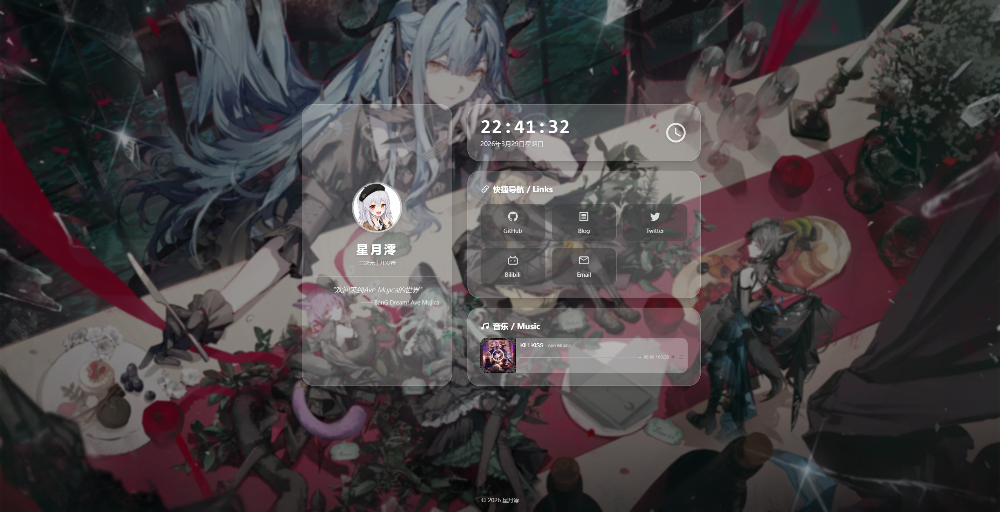

# hoshizukimio-home

一个用 Vue 3 写的单页个人主页。适合放个人简介、常用链接、博客入口和歌单，也可以当作自己的浏览器起始页。

[在线预览](https://hoshizukimio-home.vercel.app/)



## 主要功能

- 桌面端与移动端自适应布局
- 桌面、手机分别配置背景，支持本地图片和图片 API
- 一言 API、本地文案兜底和定时切换
- 普通链接与文件夹式链接分组
- 实时时钟和自定义页脚
- APlayer + MetingJS 歌单播放器
- 键盘操作、减少动态效果等无障碍适配
- 支持部署到域名根目录或子目录

页面内容主要由 `src/config.ts` 控制。只想换成自己的主页时，通常不需要修改组件代码。

## 开始使用

需要 Node.js 20.19+ 或 22.12+。

```bash
git clone https://github.com/HoshizukiMio/hoshizukimio-home.git
cd hoshizukimio-home
npm install
npm run dev
```

开发服务器默认运行在 `http://localhost:5173`。端口被占用时，Vite 会自动换到下一个可用端口。

## 改成自己的主页

打开 [`src/config.ts`](./src/config.ts)，依次修改下面几部分即可。

### 个人信息

```ts
title: "你的网站标题",
author: "你的名字",
description: "一句简短介绍",
avatar: "https://example.com/avatar.png",
favicon: "./favicon.ico"
```

以 `./` 开头的资源路径会从 `public/` 目录读取。例如 `./favicon.ico` 对应 `public/favicon.ico`。

### 导航链接

普通链接直接写地址和 Iconify 图标名：

```ts
const links = [
  {
    name: "GitHub",
    url: "https://github.com/yourname",
    icon: "mdi:github"
  },
  {
    name: "Blog",
    url: "https://blog.example.com",
    icon: "mdi:post-outline"
  }
]
```

需要分组时，使用 `folder`：

```ts
{
  type: "folder",
  name: "开发工具",
  icon: "mdi:folder-code-outline",
  children: [
    { name: "Vue", url: "https://vuejs.org/", icon: "mdi:vuejs" },
    { name: "Vite", url: "https://vite.dev/", icon: "mdi:flash-outline" }
  ]
}
```

文件夹会在弹窗中打开。图标可以在 [Iconify](https://icon-sets.iconify.design/) 搜索，复制类似 `mdi:github` 的名称即可。

### 背景

桌面和手机可以使用不同图片：

```ts
background: {
  breakpoint: 768,
  desktop: {
    mode: "list",
    list: ["./background.webp"]
  },
  mobile: {
    mode: "list",
    list: ["./background-mobile.webp"]
  }
}
```

把本地图片放进 `public/`，然后在配置里使用 `./文件名`。`list` 可以填写多张图片，页面会随机选择。

如果使用图片 API：

```ts
desktop: {
  mode: "api",
  api: "https://images.example.com/random"
}
```

加载失败时会继续尝试另一端的背景配置；全部失败时显示内置渐变背景。背景会覆盖当前视口，并在移动浏览器地址栏伸缩时自动调整高度。

### 一言

```ts
hitokoto: {
  enableAPI: true,
  api: "https://v1.hitokoto.cn?c=a&c=b&c=c",
  rotateInterval: 15000,
  localQuotes: [
    { text: "写一句自己喜欢的话。", from: "出处" },
    { text: "接口不可用时会显示这里的内容。", from: "本地" }
  ]
}
```

- `enableAPI`: 是否请求远程一言
- `rotateInterval`: 一句话显示完成后，等待多少毫秒再切换
- `localQuotes`: 接口失败或超时时使用的本地内容

不想依赖外部接口时，把 `enableAPI` 改成 `false`。

### 音乐播放器

```ts
music: {
  api: "https://meting.example.com/api",
  server: "netease",
  type: "playlist",
  id: "你的歌单 ID",
  autoPlay: false
}
```

- `api`: Meting API 地址，可以填写基础地址或带占位符的完整模板
- `server`: `netease`、`tencent`、`kugou` 等音乐平台
- `type`: `playlist`、`song`、`album`、`artist` 等数据类型
- `id`: 对应平台的歌单、歌曲或专辑 ID
- `autoPlay`: 是否自动播放音乐

播放器组件会在页面渲染后自动加载，但 `autoPlay: false` 时不会自动播放。APlayer 和 MetingJS 已随项目打包，歌单数据仍需要可用的 Meting API。建议使用自己的服务，避免公共接口失效或限流。

### 页脚

```ts
footer: {
  enabled: true,
  items: [
    "© 2026 你的名字",
    {
      text: "ICP备案号",
      href: "https://beian.miit.gov.cn/",
      target: "_blank"
    }
  ]
}
```

`items` 可以混合纯文本和链接。没有页脚内容时，也可以直接设置 `enabled: false`。

## 上线前还要改什么

除了 `src/config.ts`，建议检查以下内容：

- 替换 `public/background.webp` 和 `public/favicon.ico`
- 更新 `screenshot/screenshot.png`
- 修改 `index.html` 中的描述、Canonical 地址和分享卡片信息
- 分别在桌面和手机尺寸下确认背景裁切效果
- 确认头像、一言、背景 API 和 Meting API 允许浏览器直接访问

## 构建与部署

生成生产文件：

```bash
npm run build
```

构建结果在 `dist/`。本地检查生产版本：

```bash
npm run preview
```

这是一个纯静态项目，可以部署到 Vercel、Netlify、Cloudflare Pages、GitHub Pages 或普通静态服务器。常用构建设置如下：

- Build command: `npm run build`
- Output directory: `dist`

### 部署到子目录

如果访问地址类似 `https://example.github.io/hoshizukimio-home/`，构建时设置基础路径：

```bash
VITE_BASE_PATH=/hoshizukimio-home/ npm run build
```

路径需要以 `/` 开头和结尾。背景、图标及播放器资源都会使用同一个基础路径。

## 项目结构

```text
public/                 静态图片和 favicon
screenshot/             README 截图
src/
  components/           页面组件
  config.ts             主页内容配置
  style.css             全局样式
  utils/                 资源路径和播放器加载逻辑
index.html              SEO 与分享卡片信息
vite.config.ts          Vite 配置和子目录部署入口
```

## 常见问题

### 播放器一直显示加载失败

先直接访问配置中的 Meting API，确认它能返回 JSON；然后检查 `server`、`type` 和 `id` 是否对应。浏览器控制台里的 CORS 或网络错误通常也会指出问题所在。

### 本地背景能显示，部署后消失

确认文件放在 `public/` 中，并使用 `./background.webp` 这样的路径。部署到子目录时，还要正确设置 `VITE_BASE_PATH`。

### 构建时提示 Node.js 版本不支持

Vite 8 需要 Node.js 20.19+ 或 22.12+。升级 Node.js 后重新安装依赖即可。

## License

[MIT](./LICENSE)
